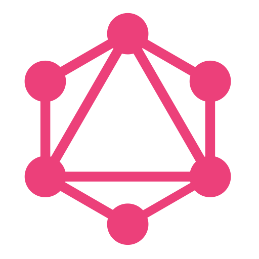
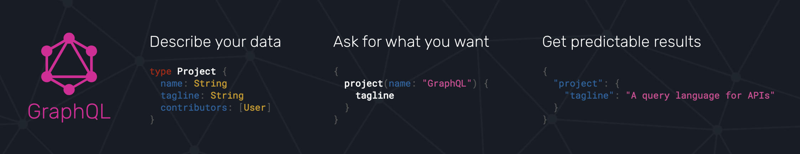
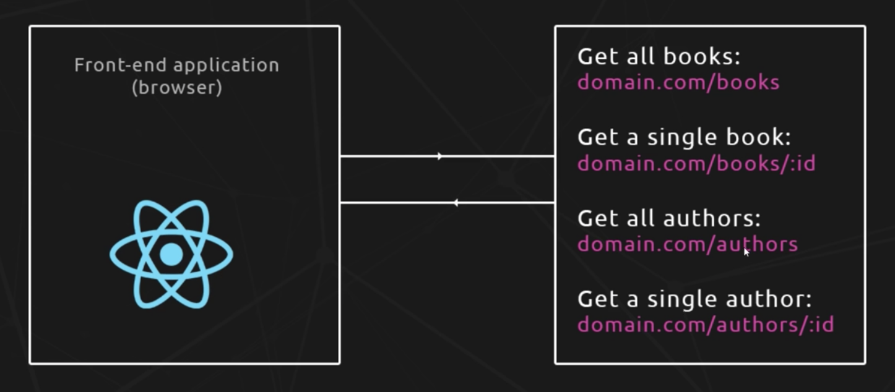

export theme from './theme';

# GraphQL


### *for dummies*

---

# What is GraphQL
- Stands for "Graph Query Language"
- An API specification invented by Facebook
- An efficient and flexible alternative to REST
- Enables declarative data fetching



---

# REST API Endpoints


---

# REST - Shortcomings
- Over/under fetching of data
- Each endpoint is structured according to clients needs
- Less flexible when client needs change <br />(or differ accross multiple clients)
- Many UI changes will likely require server changes

---

GraphQL was developed to cope with the need for more flexibility and efficiency in client-server communication


---

# GraphQL - Advantages
- Client requests precisely what data it wants
- No over/under fetching of data
- One endpoint to rule them all
- Minimizes the data transfered over the network
- Flexibility allows for rapid product iteration 
- Strongly typed Schema
- Can be used to unify existing systems and hide complexity of data fetching logic

---

# Schema
- Defines the structure and capabilites of the API
- A collection of GraphQL Types
- Serves as a contract between client and server
- [GraphQL Schema Language Cheatsheet](https://wehavefaces.net/graphql-shorthand-notation-cheatsheet-17cd715861b6)
```
type Author {
  id: String!
  name: String
  books: [Book]
}
```

```
type Book {
  id: String!
  name: String
  genre: String
  author: Author
}
```

---

# Queries
- How the client requests information from a GraphQL server
- Can request as much or as little information as necessary
- Allows for naturally querying nested information
- All possible queries are defined by the Schema

```
{
  books {
    name
    author {
      name
      books {
        name
      }
    }
  }
}
```

---

# Query Response
```
{
  "books": [
    {
      "name": "Harry Potter and the Socerer's Stone",
      "author": {
        "name": "J.K. Rowling"
        "books": [
          {
            "name": "Harry Potter and the Chamber of Secrets"
          },
          {
            "name": "Harry Potter and the Prizoner of Azkaban"
          },
          ...
        ]
      }
    }
    ...
  ]
}
```
---

# Mutations
- How to make changes to your data (create/update/delete)
- Similar syntax to queries
- All possible mutations are defined by the Schema

```
mutation {
  addBook(
    name: "Harry Potter and the Half Blood Prince",
    authorId: "1",
    genre: "Fantasy"
  ) {
    name
  }
}
```

---

# Mutation Response
```
{
  "data": {
    "addBook": {
      "name": "Harry Potter and the Half Blood Prince"
    }
  }
}
```

---

# Resolvers
- Queries/Mutations payloads consist of a set of fields
- Each field corresponds to a resolver function in the server
- The resolver will fetch data for its corresponding field
```
const BookType = new GraphQLObjectType({
  name: 'Book',
  fields: () => ({
    id: { type: GraphQLID },
    name: { type: GraphQLString },
    genre: { type: GraphQLString },
    author: {
      type: AuthorType,
      resolve(parent, args){
        return Author.findById(parent.authorId);
      }
    }
  })
});
```

---

# Apollo
- [Apollo Client (React)](https://www.apollographql.com/docs/react/) - a community-driven effort to build an easy-to-understand, flexible and powerful GraphQL client. 
- [Apollo Server](https://www.apollographql.com/docs/apollo-server/) - the best way to quickly build a production-ready, self-documenting API for GraphQL clients, using data from any source.

---

# Example Books List App
- [Client App - Apollo Client (React)](http://localhost:3006)
- [GraphQL Playground - Apollo Server](http://localhost:4000)

---

# Autofi GraphQL API
- [Cobra GraphQL Playground](http://localhost:3011/graphql?loanApplication=5c01b5ada0dbcb2484bb71fd)

---
# Some Links
- [GraphQL Docs](https://graphql.github.io/code) 
- [Apollo](https://www.apollographql.com)
- [Fullstack Tutorial](https://www.howtographql.com/)
- [Elixir Tutorial] (https://www.howtographql.com/graphql-elixir)
- [Node Tutorial](https://www.howtographql.com/graphql-js)
- [React + Apollo Tutorial](https://www.howtographql.com/react-apollo)
- [Books Example Repo](https://github.com/Dacello/graphql-books)
- [This Prezo's Repo](https://github.com/Dacello/graphql-prezo)